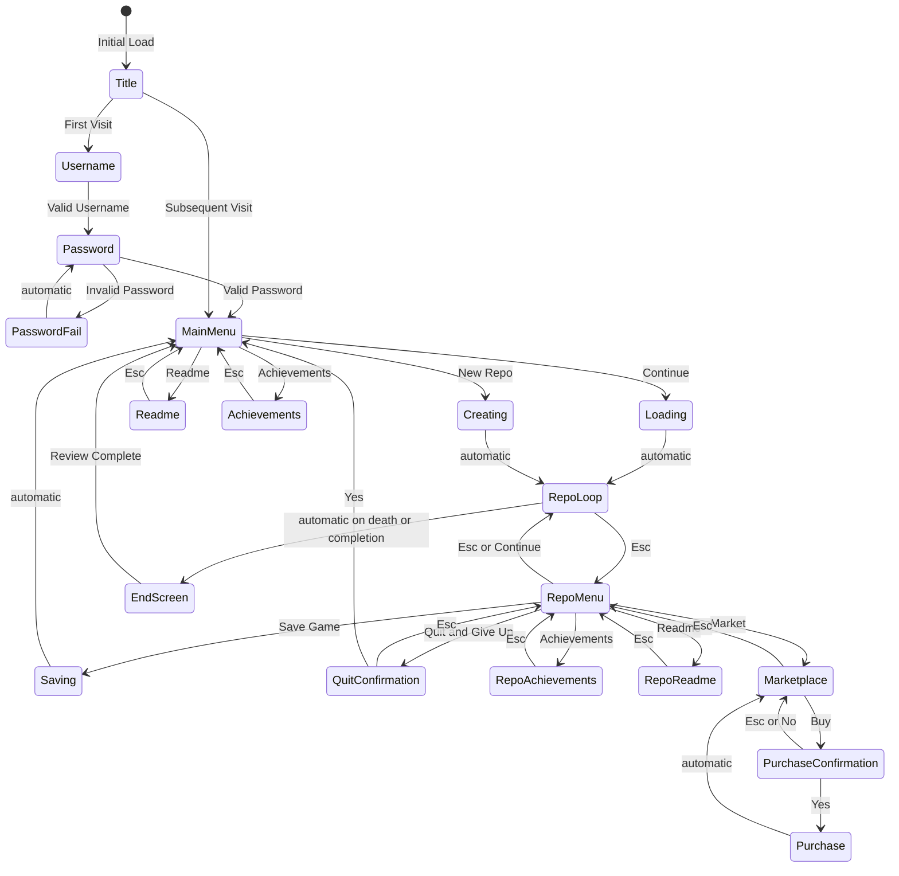

# Codetastrophy

You are the Cursor.
Chug coffee.
Throw code.
Fix bugs.

## Todo

* [ ] Finish Todo List
* [ ] Build Screen
    * [x] Build Font
        * [x] Initial Layout
        * [x] Alpha Analysis
        * [x] Build 3D texture
    * [x] Build Theme
    * [x] Build Renderer
        * [x] Data Buffers
            * [x] Distortion Uniforms (vec2 skew, vec2 warp, vec2 mask, float fxmix, float brightness, float contrast, float saturation)
            * [x] Cell Data 4800x(vec2 offset, vec4 fg, vec4 bg, float alpha, float char)
            * [x] ~~FX Data (80 x 60 UInt8 rgba ImageData~)~
            * [x] Entity Data (256 bugs, 1 dumpster fire, 1 cursor, 1 pointer)
        * [x] Vertex Shader
        * [x] Fragment Shader
        * [x] ~~Render Loop : cells.each(FX ?? Grid ?? flames) + entities~~
        * [x] Print functions
            * [x] Print
            * [x] Printf
            * [x] Text
            * [x] ~~FX~~
* [x] Build Mouse
    * [x] Add Handlers
    * [x] Add Entity
    * [x] Use canvas to spoof cursor
* [ ] Build Speaker
    * [x] Build Scales (7 of 13, 5 of 13, 5 of 7 of 13)
    * [ ] Build Rhythms
        * [ ] (1-13) of (15, 17, 23, 26)
        * [ ] fizzbuzz of (15, 17, 23, 26)
    * [ ] Build Instruments
        * [ ] Stereo Distance (`fade = xdiff, volume = 1/dist**2`)
        * [ ] Voice (attack, release, waveform, etc.)
    * [ ] Build Memes
        * [ ] Full Scale
            * [ ] Root focus (2, 1, 1, 1, 1, 1, 1)
            * [ ] Traditional (4, 1, 2, 2, 3, 1, 1)
            * [ ] Alternative (2, 1, 2, 1, 3, 2, 2)
            * [ ] Weird (1, 4, 1, 2, 1, 3, 3)
        * [ ] Penta Scale
            * [ ] Basic [2, 1, 2, 2, 1]
            * [ ] Odd [1, 2, 1, 1, 3]
    * [ ] Build Control
        * [ ] FX Controls
        * [ ] Music Controls
* [ ] Build Initial Game Components
    * [ ] Grid
        * [ ] Gutter
        * [ ] Map
        * [ ] MiniMap
        * [ ] Editor Plugins
        * [ ] Network
        * [ ] Disks
        * [ ] Backlog
        * [ ] Memory
        * [ ] Clipboard
        * [ ] Peripherals
        * [ ] Billing
        * [ ] Status Bar
        * [ ] Audio
        * [x] Console
        * [ ] Informant
        * [x] Input
        * [x] Title
        * [ ] MainMenu
        * [ ] RepoMenu
        * [ ] Achievements
        * [ ] RepoAchievements
        * [ ] Readme
        * [ ] RepoReadme
        * [ ] Marketplace
        * [ ] PurchaseConfirmation
        * [ ] Purchase
    * [ ] BusinessStuff
        * [ ] Thing
        * [ ] Prop
        * [ ] Link
        * [ ] View
        * [ ] Store
        * [ ] Action
    * [ ] Code
    * [ ] Hardware
    * [ ] Bugs
    * [ ] Plugins
* [ ] Build generator for BS to Code
* [ ] Build generator for Code to BS
* [ ] Transpile game to Code, then to BS
* [ ] Generate game from BS
* [ ] Unleash True Evil

## Dev Log

### Day 0: 2024-08-13T11:00:00.000Z

It begins. I'm still sick, but got some rest last night.
I logged on at 6 am to and checked out the [js13kGames 2024 start and theme announcement](https://medium.com/js13kgames/js13kgames-2024-start-and-theme-announcement-5d734f77da68).

> This year’s theme is… Triskaidekaphobia.

Well... it just so happens that this fits perfectly with what I wanted to do this year: **Codetastrophy**.

The basic idea is to make a *roguelike* game (I think that qualifies under the Berlin Interpretation) in which you play as the cursor in a code editor.

Most of the traditional *roguelike* elements will be present, albeit some in a different form, with some new things that are code-editor exclusives (I don't play enough games to know if these mechanics have equivalents).

I've been working on my WebGL2 skills enough that I think I can make something that will work for this. Worst case scenario I can fall back to using regular canvas calls, but I don't think that will be necessary, and honestly WebGL2 forces me to use some data structures that will improve performance in other ways.

The high-level application flow should look something like this,  with the `RepoLoop` being the main game loop, described in more detail below:

### Day 1: 2024-08-14T11:00:00.000Z

I am still sick, so was not able to put in as much time as I had hoped.
Aside from letting a little proof of concept play in the background (one that I whipped together from while I was learning WebGL2) I didn't even look at the game until after work. And supper. And medication.

Needless to say all I was really able to focus on was getting the rendering working with all of the uniforms I want to have control over, and some preliminary work on the mouse pointer.

I did manage to put together a local dev server, and work out the various imports, and now having something rendering to the screen and updating the mouse pointer at least.

Tomorrow I'll get the initial loading screen and (hopefully) login process working.

### Day 2: 2024-08-15T11:00:00.000Z

Still a little sick. Still working. Doing better, though. I didn't get to complete as much stuff this evening as I had hoped, but I DID make pretty decent progress on the Title and a few other things, as well as do some decoupling by implementing a message bus.

I've also decided on a different approach than I was originally thinking regarding the fx. At this point the actual print operations aren't that expensive, so until it becomes an issue, I will simply print fx on demand with each indivual animation encountered. We'll see how it plays out.

### Day 3: 2024-08-16T11:00:00.000Z

Still sick, and going to be working some more this evening so only getting a little time to game jam tonight.

The Discord had some great feedback that I hope I was able to integrate regarding the readability of the title screen. I like what I've come up with.

I decided I wanted to hear some things, so... I put together the speaker and voice. Now to see if we can't do something with them.

### Day 4: 2024-08-17T11:00:00.000Z

I mostly played with the speaker today.

### Day 5: 2024-08-18T11:00:00.000Z

Okay, it's time to actually get this game working. First step... username and password.

### Day 6: 2024-08-19T11:00:00.000Z

I got the start of a build working. It's only a little depressing that I'm already at 70.1% of the total 13k zip (9326 bytes currently), but that can is a problem that can be addressed soon enough.

I attempted to use a glsl minifier but it did not seem to work. I think I have a better idea how to do the minification, once I get the code generation stuff working.

I may have went overboard with the songs, but I also have some tricks to compress the data that I need to work on later. All in due time.

### Day 11: 2024-08-24T11:00:00.000Z

So... I barely did anything over the last week besides work, be sick, and run errands.

However, today I was able to make some real progress. There is so much refactoring and code golfing still to be done, but I wanted to get the basic login working, and then start playing with things in the Main Menu (not that the menu itself works).

There is still much to accomplish, and the todo list isn't even up to date (there are even things that are done that aren't in the list, and some things in the list that need to be removed).

Anywho, Codetastrophy v0.13.12214536904 is up now on <https://justinsullard.com/codetastrophy/> and in theory will remember you (if you don't `localStorage.clear()`) once you create a username, and will let you set a new password. Or will it?

### Day 12: 2024-08-25T11:00:00.000Z

Not a great deal of progress today, but I made some. I did a little golfing, and played around with getting more of the interface elements built out. Still so much to do, but I am finally feeling like I am making some progress now that there is actual interaction and the ability to move around in the (still empty) Main Menu. I also integrated some semi-randomizedd animations for the cursor to use the available character set some.

### Day 14: 2024-08-27T11:00:00.000Z

Some progress, but mostly just trying to do some golfing.

## References and Credits

There are a large number of sources that I could name, but most directly over the last couple of months, and the development of this game, these specific sources proved valuable in my efforts to implement **Codetastrophy**.

* <https://noisehack.com/custom-audio-effects-javascript-web-audio-api/>
* <https://www.shadertoy.com/view/XsjSzR>
* <https://medium.com/eureka-engineering/image-processing-with-webgl-c2af552e8df0>
* <https://www.shadertoy.com/view/XsK3RR>
* <https://developer.mozilla.org/en-US/docs/Web/API/Fullscreen_API>
* <https://dev.to/lucasdamianjohnson/using-binary-data-in-javascript-3fn2>
* <https://jsisweird.com/>
* <https://github.com/denysdovhan/wtfjs>
* <https://en.wikipedia.org/wiki/JSFuck>
* <https://github.com/scriptfoundry/WebGL2-Videos-Materials>
* [Image Optimizer](https://github.com/GijsGoudzwaard/Image-Optimizer)